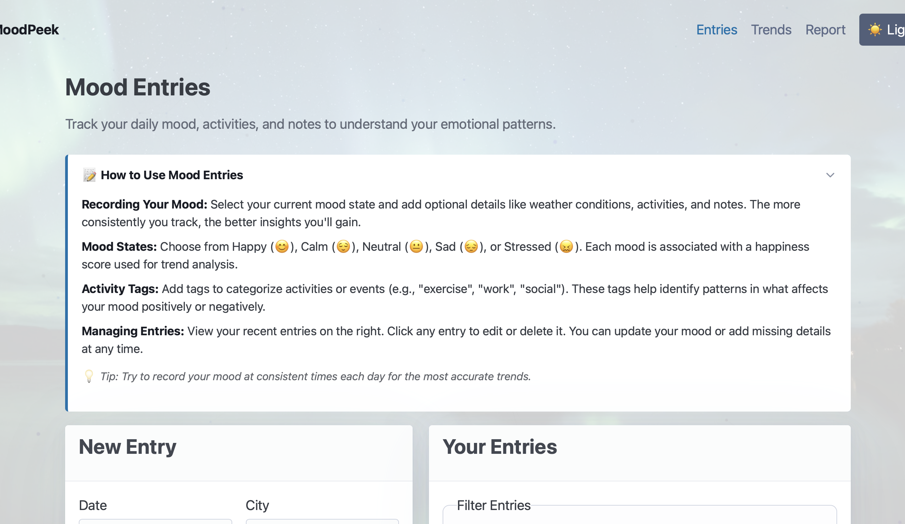

# MoodPeek

MoodPeek is a full-stack mood tracking application with weather correlation features built with the MERN stack (MongoDB, Express, React, Node.js). It allows users to track their mood entries and discover correlations between their mood and weather conditions.



## Features

-  **Daily Mood Tracking**: Log your mood with contextual information like tags, notes, and location
-  **Automatic Weather Data**: Weather conditions are automatically fetched based on your city
-  **Data Visualization**: Interactive charts to visualize mood patterns over time
-  **Insights Generation**: Weekly reports with mood analysis and tag contributions
-  **Weather Correlation**: Discover how temperature and humidity affect your mood
-  **Dark Mode Support**: Automatically adapts to system preferences with dark mode
-  **Unsplash Integration**: Dynamic mood-related images with caching


## Tech Stack

### Backend
- **Node.js & Express**: RESTful API server
- **MongoDB & Mongoose**: Database and ODM
- **Open-Meteo API**: Weather data integration

### Frontend
- **React & Vite**: UI framework with fast build tool
- **TypeScript**: Type-safe development
- **Tailwind CSS**: Utility-first CSS framework
- **SWR**: Data fetching and caching
- **D3.js**: Data visualization
- **Alpine.js**: Lightweight JavaScript framework for simple interactions

## Getting Started

### Prerequisites

- Node.js (v18+)
- MongoDB Atlas account or local MongoDB instance
- Git

### Installation

1. Clone the repository:
   ```bash
   git clone https://github.com/yourusername/moodpeek.git
   cd moodpeek
   ```

2. Install all dependencies:
   ```bash
   npm run install:all
   ```

3. Create a `.env` file in the server directory:
   ```
   MONGODB_URI=your_mongodb_connection_string
   PORT=5174
   ```

4. Start development servers:
   ```bash
   npm run dev
   ```
   - Backend server will run on: http://localhost:5174
   - Frontend dev server will run on: http://localhost:5173

### VS Code Setup (Optional)

If you see CSS warnings about `@tailwind` directives:
- Install the **Tailwind CSS IntelliSense** extension (recommended)
- Or reload VS Code window (Cmd+Shift+P → "Reload Window")
- The warnings are cosmetic and don't affect functionality

## API Documentation

### Entries API

| Method | Endpoint | Description |
|--------|----------|-------------|
| GET | `/api/entries` | Get all mood entries |
| GET | `/api/entries/:id` | Get a specific entry |
| POST | `/api/entries` | Create a new entry |
| PUT | `/api/entries/:id` | Update an entry |
| DELETE | `/api/entries/:id` | Delete an entry |

### Insights API

| Method | Endpoint | Description |
|--------|----------|-------------|
| GET | `/api/insights/weekly?start=YYYY-MM-DD` | Get weekly insights report |

## Image Handling Architecture

MoodPeek implements a robust, security-focused image handling system:

### Key Principles

- **No Direct External URLs**: The client never connects directly to external image hosts (Unsplash/Picsum)
- **Server-Side Proxy**: All image requests go through our server endpoints (`/api/images/*`)
- **Disk Caching**: Images are downloaded once and stored on disk at `/imgcache/<hash>.jpg`
- **Performance Optimization**: Client-side localStorage caches image paths (not the images themselves)
- **No Database Storage**: Image binaries are never stored in MongoDB
- **Privacy & Security**: All external image requests happen server-side with proper headers

### Implementation Details

1. **Client-Side Flow**:
   - Client requests image via `/api/images/{type}?q={query}`
   - Server returns local path like `/imgcache/<hash>.jpg`
   - Path is cached in localStorage for quick access
   - Client validates cached URLs with `ensureImage()` before use

2. **Server-Side Flow**:
   - Server receives image request with query parameters
   - Checks disk cache first (based on hash of query + dimensions)
   - If not cached, fetches from Unsplash API
   - If Unsplash fails, downloads from Picsum as fallback
   - Saves image to disk and returns local URL path

3. **Database Approach**:
   - MongoDB stores only entry metadata (date, mood, city, tags, weather)
   - No image binary data is stored in the database
   - Image paths (`/imgcache/*`) are derived values and not required to be stored
   - Client's localStorage maintains the URL cache, reducing server load

4. **Cache Management**:
   - Client purges any external URLs from localStorage on app start
   - Server serves static `/imgcache` files with `Cache-Control: public, max-age=3600`
   - Client refreshes stale images (>12h old) in the background

## Project Structure

```
moodpeek/
├── client/                 # Frontend React application
│   ├── public/             # Static files
│   └── src/                # Source code
│       ├── api/            # API service layer
│       ├── components/     # React components
│       │   ├── charts/     # D3.js visualization components
│       │   └── reports/    # Report components
│       ├── pages/          # Page components
│       └── types.ts        # TypeScript definitions
│
├── server/                 # Backend Express application
│   ├── models/             # Mongoose schemas
│   ├── routes/             # API routes
│   ├── services/           # Business logic services
│   └── index.js            # Server entry point
│
└── package.json            # Root package.json with scripts
```


## Recent Enhancements

### Unsplash Integration
- **Server-side caching**: Images are cached for 1 hour to reduce API calls
- **Client-side caching**: localStorage is used to store images for 24 hours
- **Mood-based queries**: Images are fetched based on mood and city
- **Attribution**: Proper attribution is given to Unsplash as required by their API terms

### Dark Mode Support
- **CSS Variables**: Consistent theming across light and dark modes
- **Media Query Detection**: Automatically switches based on system preferences
- **Semantic Colors**: Using variables like `--surface-1`, `--text`, and `--accent` instead of hard-coded colors

### Accessibility Improvements
- **Semantic HTML**: Proper heading hierarchy and landmark regions
- **ARIA Attributes**: Improved screen reader support
- **Keyboard Navigation**: Enhanced focus management
- **Form Labels**: All inputs have associated labels
- **Color Contrast**: Meets WCAG AA standards in both light and dark modes

### Utility Scripts
- **Color Scanner**: Script to identify hard-coded colors in the codebase
- **Environment Setup**: Simplified configuration with environment variables

## License

This project is licensed under the MIT License - see the LICENSE file for details.

## Acknowledgments

- [Unsplash](https://unsplash.com) for providing free high-quality images
- Open-Meteo API for free weather data
- D3.js community for visualization examples
- [Pico CSS](https://picocss.com) for the minimal CSS framework
- The a11y community for accessibility guidelines and best practices# moodpeek1
